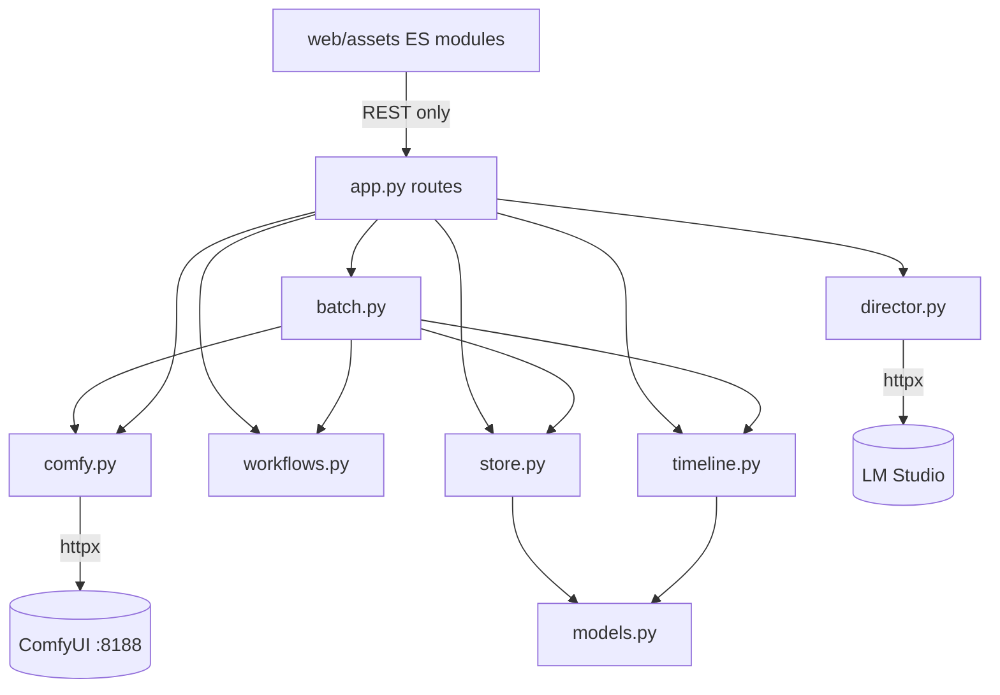

# Architecture Spine — MusicVideoProducer MVP

## Design Paradigm

**Manifest-centric layered monolith with explicit workflow adapters.** One FastAPI process, one browser client, one JSON manifest per project as the sole source of truth.

- **Routes** (`app.py`) — thin HTTP delegators; orchestration only, no domain math.
- **Domain logic** (`timeline.py`, `director.py` guards, `workflows.py` builders, new `batch.py`) — pure or near-pure functions over models.
- **Clients** (`comfy.py`, `director.py` HTTP) — bounded-timeout httpx; the only modules that speak to other processes.
- **Persistence** (`store.py`, `models.py`) — atomic full-manifest writes; Pydantic models are the schema.
- **Frontend** (`web/assets/*.js`) — dependency-free ES modules; a pull-based mirror of the loaded Project; no framework, no CDN, ever.

Derived state beats stored state everywhere a value can be computed from the manifest (wizard step, batch status, media presence). ComfyUI's `/queue` + `/history` are the source of truth for render execution; the manifest is the source of truth for everything else.



Dependency rule: arrows only point downward/rightward as drawn. `comfy.py`, `director.py`, `store.py`, `models.py`, `timeline.py`, `workflows.py` never import `app.py` or `batch.py`. The frontend never calls ComfyUI or LM Studio directly except for `/view` media URLs already built by the backend.

## Invariants & Rules

### AD-1 — Render-state transport is client polling of the app's own API

- **Binds:** FR-6, FR-7, FR-8, NFR-1 (Epic 4)
- **Prevents:** two sources of render truth (WebSocket events vs queue/history), and today's per-job `/queue` fan-out (40 jobs = 40 queue calls)
- **Rule:** The browser polls **one** app endpoint — `GET /api/projects/<project_id>/render-status` — on a **2 s interval while any batch or job is active**, and stops when none is. The response carries every non-terminal job (`id`, `batch_id`, `status`, `error`, `output_files`) plus each affected Shot's derived state; Queue rows and timeline clips render from this single response. Per tick, the backend fetches ComfyUI `/queue` **once**, classifies every non-terminal job against it, and calls `/history/<prompt_id>` only for jobs absent from the queue. Reconciliation logic exists **once**, in `batch.py`; the legacy per-job route delegates to it — no second mutation path for job/Shot status. No ComfyUI WebSocket subscription, no SSE, no server push. Restart-mid-batch reconciliation uses the same code path — `/queue` + `/history` remain the only execution truth. A later `/ws` subscription may only *wake* this reconciler early; it may never become a second source of truth.

### AD-2 — NFR-1 concrete bounds

- **Binds:** NFR-1, all Epic 4 stories
- **Prevents:** "responsive" degrading into an untestable adjective
- **Rule:** `/api/health` answers within **500 ms** while any ComfyUI request is held open. A completed Shot is visible on the timeline within **3 s** of its ComfyUI history entry (one poll interval + render). Every outbound httpx call carries the configured bounded timeout (default 30 s). No route performs unbounded work in the event loop; local ffmpeg work runs via `asyncio` subprocess or executor.

### AD-3 — Wizard step is a frontend-only pure function

- **Binds:** FR-1, FR-2, FR-3 (Epic 6)
- **Prevents:** a server-side wizard state that lags the client's dirty, unsaved edits; a persisted progress field that can desynchronize
- **Rule:** `deriveStep(project)` lives in a new ES module `web/assets/wizard.js`, computed over the already-loaded `state.project`. No backend wizard endpoint; no wizard field in the manifest. `app.js`'s `renderAll()` decorates the existing rail and renders the guidance banner from its result — the wizard adds **no new surface** and each step shows the real workspace component (UX contract). Session-only dismissal lives in frontend state.

### AD-4 — Wizard derivation chain (fixed)

- **Binds:** FR-1, FR-3
- **Prevents:** two builders inventing incompatible step predicates
- **Rule:** Evaluate in order: no `song` → **01 Song**; song and no `shots` → **02 Treatment**; shots and no character Asset with non-null `parent_id` (Reference Sheet) → **03 Cast** (Assets workspace, scoped); any shot with empty `prompt` or status `draft` → **04 Shots** (Timeline); else → **05 Render** (Queue, scoped to pre-flight). Any RenderJob with `kind: h3` and `status: complete` → wizard permanently off for that project. Future steps stay clickable; the wizard guides, never locks.

### AD-5 — Batch orchestration lives in a new `batch.py`

- **Binds:** FR-4, FR-5, FR-9, FR-26 (Epics 2, 4)
- **Prevents:** `app.py` (already 800 lines) absorbing domain logic; `timeline.py` (pure window math) absorbing I/O
- **Rule:** New backend module `batch.py` owns: `readiness_report(project)` (empty prompt **blocks** naming Shot IDs; near-duplicate prompts — identical after lowercase/whitespace collapse, or >90 % token overlap — **warn**), submission ordering, batch submission orchestration, and the batch reconciliation AD-1's endpoint calls. `app.py` routes delegate to it. Regeneration of one Shot reuses the identical submission path with a single-shot set.

### AD-6 — Kind-grouped submission order; nothing evicts the resident stack

- **Binds:** FR-9 (Epic 4)
- **Prevents:** interleaving text-only H3 and H3 Ultra prompts — they load **different UNET sets**, costing ~150 s per eviction (measured 438 s cold / 288 s warm)
- **Rule:** Within a Batch, Shots are submitted grouped by payload kind: all text-only H3 contiguous, all H3 Ultra contiguous, no other workflow kind interleaved. The batch path never issues a ComfyUI free, unload, or interrupt call. Flagged-set resubmission is refused while any batch is active, preserving the ordering guarantee.

### AD-7 — Batch and flag state shape

- **Binds:** FR-4, FR-5, FR-8; `models.py`
- **Prevents:** a stored Batch entity whose status field can contradict its member jobs
- **Rule:** `RenderJob` gains `batch_id: str = ""`; `Shot` gains `flagged: bool = False`. **No Batch model, no batch status field**: a batch is the set of jobs sharing a `batch_id`, and it is *active* iff any member is non-terminal — always derived, never stored. Both fields default so existing manifests load unchanged (schema-evolution convention below). The flag is independent of render state; it is cleared by successful resubmission of that Shot or by manual unflag, never by the batch draining. Resubmitting the flagged set mints a **new** `batch_id`.

### AD-8 — LM Studio coordination through the native v1 REST API

- **Binds:** FR-10, FR-11 (Epic 4)
- **Prevents:** each builder inventing its own LM Studio probe or assuming unload succeeded
- **Rule:** `DirectorClient` gains `loaded_models()` and `unload_all()` using LM Studio's native REST API — `GET /api/v1/models`, `POST /api/v1/models/unload` (`instance_id`) — derived from the configured `llm_base_url` host:port (API documented 2026-08-16, and `GET /api/v1/models` **probed live against the installed instance the same day** — the endpoint responds with the expected `loaded_instances` shape, so the version assumption is closed). Success is never assumed: after unloading, free VRAM is re-read from ComfyUI `/system_stats` and *reported*. Unload failure or absent configuration never blocks rendering — the risk is stated at the pre-flight modal. VRAM is context, never a gate.

### AD-9 — Assembly is local ffmpeg, job kind `post`, trim-then-concat

- **Binds:** FR-22, FR-24 (Epic 5)
- **Prevents:** assembly drifting onto ComfyUI, or untrimmed joins accumulating ~11 % grid drift (4.0 s Shot renders 4.458 s)
- **Rule:** Assembly runs in the app backend via non-blocking ffmpeg subprocess (extending the existing `ffprobe` pattern), never on ComfyUI. Each Approved Output is accurately trimmed to its Shot window, clips are concatenated in Shot order, and the master Song is muxed as the sole audio track — shot audio is dropped at assembly (decided by the Director 2026-08-16). Output lands under the project media dir (`media/exports/`); the file is `ffprobe`-verified after writing, duration within one frame of the Song. Recorded as a `RenderJob` of `kind: "post"` with empty `prompt_id`/`seed` by design, inputs and output in `output_files`/provenance fields, reconciled **locally** — `post` jobs never touch the ComfyUI queue path. Assembly refuses on: any unapproved Shot, a stale take (window changed after approval), gaps/overlaps against the Song — each reported by Shot ID.

### AD-10 — SongPlanner adapters share one core

- **Binds:** FR-13, FR-14 (Epic 1)
- **Prevents:** two divergent 20-node graphs differing in more than lyric handling
- **Rule:** Two thin builders in `workflows.py` over one shared private core (`_build_songplanner_core`), differing only in lyric handling; supplied lyrics pass verbatim. A unit test asserts payload equality except lyric nodes. Built from audited, checksummed reference exports (`SongPlanner + MiniMax Music 3 - Quality BF16.json` / `...-Known_Lyrics.json`) per existing adapter discipline; pre-flight audit validates classes against live `/object_info` (combo options at `[1]["options"]` on ComfyUI 0.33.1). Job kind `music`.

### AD-11 — Missing media is computed at read time, never persisted

- **Binds:** FR-25 (Epic 5)
- **Prevents:** the manifest recording a "missing" verdict that outlives the condition
- **Rule:** A dedicated `GET .../media-status` endpoint stat-checks every recorded Shot output and Asset path and returns the missing set; it never mutates the manifest. The frontend renders the `MISSING` placeholder per DESIGN.md. Malformed manifests continue to be skipped during listing (existing `store.list()` behaviour, regression-guarded).

### AD-12 — Finishing's standalone adapter takes the approved file as input

- **Binds:** FR-23 (Epic 7, drop-conditioned)
- **Prevents:** the known blocker — combined exports that regenerate the Shot from creator-specific media
- **Rule:** `build_ltx_finishing_payload()` in `workflows.py` builds a graph whose **input is the Approved Output file** (uploaded to ComfyUI input), contains zero H3 generation nodes, and includes the audited `ImageResizeKJv2` `divisible_by=32` boundary patch before every LTX image consumer. Job kind `ltx`. A finished result is a new selectable take; approval remains the Director's explicit act. Failure leaves the input Approved Output untouched. Story 7.1's go/no-go spike gates the epic; the PRD drop condition stands.
- **Amended 2026-08-17 — divisor 16 → 32, on live evidence.** This rule bound `divisible_by=16` when ratified. The live boundary run (prompt `a64a0460-64e6-4a14-b207-e644bf9bda5d`, `success` in 17 min 36 s) disproved 16: the LTX 2.5 VAE's total spatial compression is 32 (`comfy/sd.py:612-618` sets `crop_input = False` and `downscale_ratio = (…, 32, 32)`), so 16 leaves height 720 (720/32 = 22.5). `ffprobe` on the produced file measured **2496×1408**, exactly 2 × 1248×704 through the subgraph's 2× latent upsample; 16 would have produced 2496×1440. The repo patch, the Director's saved workflow, and `docs/WORKFLOW-MAP.md` all carry 32. Consequence Epic 7 must absorb: the boundary does **not** preserve frame count — 192 in, 185 out (8k+1).

### AD-13 — Approval is `approved_output`, nothing else `[ADOPTED]`

- **Binds:** FR-21, FR-5; `models.py`
- **Prevents:** two representations of approval drifting (the `ShotStatus` literal `"approved"` vs the field)
- **Rule:** Approval is represented **only** by a non-empty `approved_output`. The `"approved"` member of `ShotStatus` is dead: never written, never read. Approval is reversible, never set by render completion, and Regeneration replaces only `latest_output` — approving the new take is a separate act. To make Story 5.2's stale-take refusal decidable, approval snapshots the window: `Shot` gains `approved_start: float = 0` and `approved_duration: float = 0`, set at approval, cleared at unapprove; Assembly compares them to the live `start`/`duration` and refuses on mismatch by Shot ID.

### AD-14 — Director output crosses the persistence boundary only through guards `[ADOPTED]`

- **Binds:** FR-15, FR-16, FR-17, FR-26 (Epic 2)
- **Prevents:** the reproduced self-reinforcing JSON corruption of creative documents
- **Rule:** Every LLM result passes `document_rejection()` (JSON-as-prose, <40 % collapse, empty-target skip) before assignment; empty-shots-with-prose-claims is a notice, never an application; out-of-window shots (outside 4–15 s) are flagged, never silently rewritten. FR-16 adds: `Project` gains single-slot recovery fields `treatment_previous: str = ""` and `style_bible_previous: str = ""`, written whenever the live document is replaced; restore swaps them back without a Director call; locked fields are never modified. Story expansion (FR-26) is **one Director call over the whole plan** — per-shot calls cannot see each other, so deliberate cross-shot variance requires whole-plan visibility; the call receives Treatment, Style Bible, and every Shot window with its position in the Song, and its results land as editable per-Shot prompts through this same guard path. Expansion **never queues a render**.

### AD-15 — Standing boundary policies `[ADOPTED]`

- **Binds:** all
- **Prevents:** any epic quietly crossing a boundary the Director already ruled on
- **Rule:** The application never starts, stops, restarts, interrupts, or kills ComfyUI. Expensive renders require explicit confirmation (one confirmation covers a Batch). Saved editor JSON is never submitted to `/prompt` — only versioned explicit API-format adapters. `workflow_templates/reference_exports/` is immutable audited evidence. No Agent OS coupling. The GPL Director extension's frontend is never copied. LLM output creates records; it never queues renders and never approves takes.

## Consistency Conventions

| Concern | Convention |
| --- | --- |
| Schema evolution | New model fields always carry defaults so every existing `project.json` loads unchanged; fields are never renamed or removed in MVP |
| State mutation | Every mutation flows through `store.save(project)` full-manifest atomic write (temp file + replace); shot saves stay serialized; stale full-Project replacement stays 409 |
| Derived vs stored | Anything computable from the manifest (wizard step, batch activity, media presence, readiness) is computed, never stored |
| Errors | Backend raises `HTTPException` with plain-language `detail`; ComfyUI errors surface verbatim on the owning Shot/job; 502 = downstream ComfyUI/LM error, 422 = validation, 409 = stale |
| Paths | Manifest paths are project-relative or ComfyUI-output-relative, forward slashes, resolved only beneath their root (existing traversal guards); output `subfolder` separators normalized to `/` |
| IDs | `new_id(prefix)` — `shot_*`, `job_*`, `asset_*`, `batch_*`, `msg_*` |
| Frontend | Dependency-free ES modules only; new UI composes existing tokens per DESIGN.md (one state = one color everywhere); no new modal beyond the pre-flight; Consolas micro-labels carry into new components |
| Naming | New backend module = one lowercase noun (`batch.py`); payload builders = `build_<workflow>_payload` in `workflows.py` |
| Tests | Payloads validated against recorded `/object_info` fixtures + live pre-flight audit before first submission (Story 3.1 pattern); scripts/tests set `PYTHONIOENCODING=utf-8` on Windows |
| Time/units | Shot timing in seconds against the Song; frames only at the workflow boundary via `timeline.align_h3_frames` (17k+5 grid) |

## Stack

Seed — ratified as-is from the working codebase; the code owns this.

| Name | Version |
| --- | --- |
| Python | 3.11 (uv-managed) |
| FastAPI + Pydantic v2 + pydantic-settings | as pinned in `pyproject.toml` |
| httpx (async, bounded timeouts) | as pinned |
| Frontend | native ES modules, Web Audio/Canvas — no framework, no CDN |
| ComfyUI (user-managed, external) | 0.33.1 portable, RTX 5090 |
| LM Studio (user-managed, external) | ≥0.4.0 (native `/api/v1` REST) |
| ffmpeg/ffprobe | system, invoked via subprocess |

## Structural Seed

```text
src/music_video_producer/
  app.py         # FastAPI routes — thin delegators (existing + batch/assembly/media-status/song-gen routes)
  batch.py       # NEW — readiness gate, kind-grouped ordering, batch submit + reconcile
  comfy.py       # ComfyUI client (existing; queue_state() is the running/queued authority)
  config.py      # MVP_-prefixed settings (existing)
  director.py    # LLM client + guards (existing; + loaded_models()/unload_all())
  models.py      # manifest schema (existing; + RenderJob.batch_id, Shot.flagged, Shot.approved_start/approved_duration, Project.treatment_previous/style_bible_previous)
  store.py       # atomic persistence (existing, ratified — do not refactor)
  timeline.py    # pure shot-window math (existing — stays I/O-free)
  workflows.py   # payload builders (existing; + 2 SongPlanner builders, LTX finishing builder)
  web/assets/
    api.js       # fetch wrapper (+ batch/status/media-status calls)
    app.js       # render pass (+ rail decoration, banner, chips, pre-flight modal, poll loop)
    state.js     # client state (+ session wizard dismissal, poll bookkeeping)
    wizard.js    # NEW — pure deriveStep(project) + step metadata
data/projects/<id>/project.json   # source of truth
data/projects/<id>/media/exports/ # assembled videos
```

## Capability → Architecture Map

| Capability | Lives in | Governed by |
| --- | --- | --- |
| FR-1..3 Wizard | `wizard.js` + `app.js` rail/banner | AD-3, AD-4 |
| FR-4/5/9 Batch + regen | `batch.py` + routes | AD-5, AD-6, AD-7 |
| FR-6/7/8 Live state, timeline, flags | `batch.py` reconcile + `app.js` poll loop | AD-1, AD-2, AD-7 |
| FR-10/11 GPU coordination | `director.py` + pre-flight modal | AD-8 |
| FR-12 Song import | existing (`app.py` upload + ffprobe) | ratified, regression-guarded |
| FR-13/14 Song generation | `workflows.py` SongPlanner builders | AD-10 |
| FR-15/16/17/26 Director safety + expansion | `director.py` guards + `batch.py` readiness | AD-14, AD-5 |
| FR-18/19/20 Continuity/reference path | existing (`app.py` h3 route, `workflows.py` Ultra) | ratified; Epic 3 verifies live |
| FR-21 Approval | `models.py` + timeline UI | AD-13 |
| FR-22 Assembly | `app.py` route + ffmpeg subprocess | AD-9 |
| FR-23 Finishing | `workflows.py` finishing builder | AD-12 |
| FR-24 Provenance | `models.py` RenderJob (existing) | ratified; AD-9 for `post` kind |
| FR-25 Missing media | media-status endpoint + `app.js` | AD-11 |
| NFR-1 Responsiveness | all outbound calls + poll design | AD-1, AD-2 |
| NFR-2 Integrity | `store.py` (existing) | ratified — regression-guard, never rebuild |

## Operational Envelope

Single-machine, single-user, local-only: `uv run uvicorn` on `127.0.0.1:8765`; ComfyUI at `:8188` and LM Studio are user-managed external processes the app observes but never controls. No deployment tiers, no telemetry, no remote access (PRD non-goals). Configuration via `MVP_*` env / `.env` only; API keys never in the manifest. Backup unit = the project directory (`project.json` + `media/`); ComfyUI outputs are recoverable-by-provenance, not backed up.

## Deferred

- ~~Assembly audio mix~~ — **decided 2026-08-16: master Song only**; shot audio dropped at assembly. Per-shot opt-in mixing is a possible v2 refinement.
- ~~Delivery resolution/steps policy~~ — **decided 2026-08-16: two presets** — Draft 640×384/8 steps for cheap full-video passes, Master 1344×768/20 steps (existing `H3Request` defaults) for the real render. The pre-flight modal selects the preset; Regeneration inherits the Shot's last-used preset.
- **ComfyUI `/ws` wake-up upgrade** — permitted by AD-1 only as a reconciler trigger; build only if 2 s polling is ever felt.
- **SageAttention enablement** — a measured spike per the addendum; the `disabled` pin stands until a Blackwell-compatible build is verified.
- **Song residency idle-window behaviour** (how long the warm stack survives a gap) — measure when it matters; AD-6 already avoids defeating it.
- **Vision-assisted flagging** (PRD Q4) — flag stays a Director's-eye act in MVP (SM-C3).
- **Undo/redo, BPM lanes, take history** — PRD out-of-scope; nothing in AD-7's shape blocks a later history mechanism.
- **`docs/ARCHITECTURE.md` update** to record the wizard reconciliation and new decisions — documentation task for the first Epic 6 story, not this artifact.
