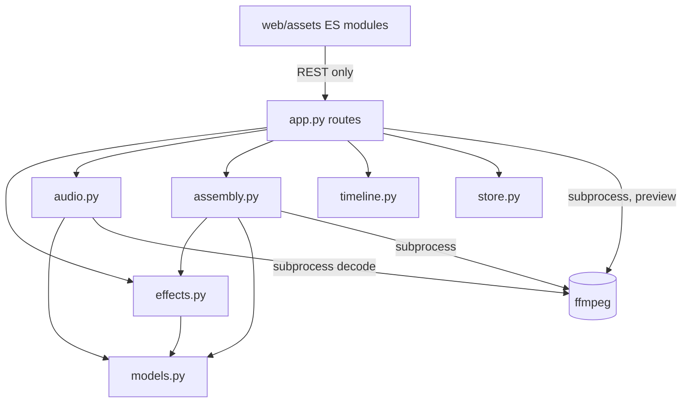

# Architecture Spine — Shot Effects and Transitions

## Design Paradigm

Inherited unchanged from the MVP spine. This feature adds **two pure modules and no new process, transport, or storage engine**.

The one paradigm-level statement worth making explicitly, because it governs every AD below:

> **Everything the export does is a pure function of the manifest, expressed as text, and compared as text.** A filter chain, a concat list, a `sendcmd` script — each is built by a pure function, asserted in tests by string comparison, and re-derivable from the manifest alone. Preview is the same text, at smaller dimensions.



`effects.py` and `audio.py` obey the standing dependency rule: neither imports `app.py`, `batch.py`, or `assembly.py`. `assembly.py` imports `effects.py` and not the reverse — the chain builder must not know what a clip is.

## Inherited Invariants

Binding, read-only. Not re-derived here.

| AD | Why it constrains this feature |
| --- | --- |
| **AD-9** — assembly is local ffmpeg, trim-then-concat, one cumulative 24 fps grid | The frame grid this feature must not move. Every transition decision below exists to satisfy it. |
| **AD-11** — missing media computed at read time, never persisted | The precedent for AD-21 and AD-23: a validity verdict is derived, never stored. |
| **AD-13** — approval is `approved_output`, with the window snapshot | Effects treat the approved file and never rewrite it. |
| **AD-14** — model output crosses the persistence boundary only through guards | Extends to effect specs arriving from the client. |
| **AD-15** — standing boundary policies | ComfyUI is untouched by anything in this feature. |
| Consistency Conventions (schema evolution, state mutation, paths, IDs, tests) | Apply verbatim. New fields carry defaults; every mutation goes through `store.save`. |

**No AD below contradicts or weakens an inherited one.** AD-9's rule is extended by AD-18 in the one direction it did not cover — a clip that blends into its neighbour — and the extension preserves every property AD-9's Rule states.

## Invariants & Rules

### AD-16 — Effects live on `Shot`, and only dedicated routes may write them

- **Binds:** FX-5, FX-6, FX-7, FX-12, FX-17, FX-23
- **Prevents:** a whole-manifest save silently clearing every Effect Stack in the project
- **Rule:** `Shot` gains `effects: list[EffectSpec]`, `transition_in: TransitionSpec | None`, `transition_out: TransitionSpec | None`, all defaulted so every existing manifest loads unchanged. They are written **only** by dedicated routes under `/api/projects/{id}/shots/{shot_id}/effects` and `.../transitions`. `replace_project` (the generic `PUT /api/projects/{project_id}`) **adopts them from the stored Shot**, via the established `_adopt_*` idiom already used for the Song's recovery slots and vocal type — a body that omits them, or invents them, does not change them. A test asserts a full-project PUT that omits `effects` leaves every stack intact.

> That route's own comments record this hole being found **six times**. This AD exists so it is not found a seventh.

### AD-17 — One chain builder, one fixed stage order

- **Binds:** FX-8, FX-9, FX-10, FX-11, FX-NFR-3
- **Prevents:** each effect choosing its own insertion point, and a geometry effect resampling an already-scaled frame
- **Rule:** `effects.py` exposes one pure function that takes a Shot's Effect Stack and the export geometry and returns the ordered filter-stage list `assembly.trim_args` splices in. Family order is fixed and not the Director's to reorder:

  ```
  trim → GEOMETRY → scale → TEXTURE → GRADE → STYLIZE → pad → fps → setsar → format
  ```

  Within a family, order is the Director's. **Geometry precedes `scale`** so a punch-in samples the take's own pixels. **Every treatment precedes `pad`**, so the letterbox bars stay clean: measured 2026-08-21 on a 4:3 source into a 16:9 target, texture after `pad` leaves the bar at RGB `(1,1,5)` and before `pad` at `(0,0,0)`. This closes the PRD's open question 1 and confirms its FX-9 assumption. The frontend never composes a filter string; it sends specs.

### AD-18 — A transition is its own concat intermediate

- **Binds:** FX-16, FX-19, FX-NFR-1, FX-NFR-2
- **Prevents:** an `xfade` chain re-encoding the whole timeline and adding a generation of loss to effect-free clips
- **Rule:** For an Overlap between clips A and B, `assembly_plan` emits **three** entries — A truncated to the Overlap's start, a transition segment, B from the Overlap's end — and the concat list joins them with `-c:v copy` unchanged. The transition segment is rendered by its own pinned argv from A's and B's overlapping frames through `xfade`, at the same normalized geometry, rate, SAR and pixel format as every other intermediate, which is what makes `xfade`'s equal-input precondition hold by construction. **The transition segment's frame count is exactly the Overlap's frames on the existing cumulative grid** — `clip_frames_on_grid` is not modified and the telescoping is unchanged.

### AD-19 — The Overlap is the only transition geometry

- **Binds:** FX-16, FX-17, FX-18, FX-NFR-1
- **Prevents:** a second, invisible source of transition length, and transitions that fail on external clips
- **Rule:** A paired transition's duration **is** the Overlap's duration. There is no stored duration field for it and no borrowing from the over-render margin — external clips carry no margin (`app.py`'s own note) and a margin-derived length is invisible to the Director. A transition-out with no Overlap is **one-sided**: a filter applied to the tail of that clip's own intermediate, single-input, no `xfade`, no change to frame count, no frames taken from a neighbour. Both cases leave every clip's timeline position untouched, which is how FX-NFR-1 is satisfied structurally rather than arithmetically.

### AD-20 — The Song Envelope is a sidecar, never a manifest field

- **Binds:** FX-1, FX-2, FX-3, FX-13
- **Prevents:** a three-quarter-megabyte analysis riding the 2-second poll and every atomic manifest write
- **Rule:** The envelope is written as its own file under the project's media dir. The manifest carries only a small `SongAnalysis` record: the sidecar's relative path, the analysis rate, the band count, the estimated BPM, and the **song fingerprint** it was computed from. **Amended 2026-08-24 (R-8 rulings doc):** measured through the shipped extractor, a 3-minute envelope is **405 KB** of JSON and a real 202-second master's is 469 KB — against manifests of 110–190 KB, so two to four times the manifest rather than four to seven. The estimate this sentence carried (~750 KB) and a later synthetic probe (1.13 MB) were both wrong; 405 KB is the measured figure and the conclusion is unchanged. Since 2026-08-24 the browser is served only the part it reads — `beats`, `onsets`, `band_average`, `band_edges` — and the per-frame series, 98% of the file, stays on disk. The envelope is served by its own read-only endpoint and is never embedded in a Project response.

### AD-21 — Envelope validity is derived from a fingerprint, never stored as a flag

- **Binds:** FX-1, FX-15
- **Prevents:** a stale envelope that reports itself current, and a "valid" flag that outlives its condition
- **Rule:** Following AD-11's read-time discipline. Every read compares the stored song fingerprint against the current Song's; a mismatch means the envelope is **absent**, reported as such, and never served as current. Stored Parameter Bindings are **retained and reported unresolvable** — never dropped, never silently zeroed. Re-analysis makes them live again. Nothing writes an invalidation flag, because a flag is a second truth that can disagree with the first.

### AD-22 — Reactive drive is a generated `sendcmd` script, passed cwd-relative

- **Binds:** FX-12, FX-14, FX-NFR-5
- **Prevents:** two mechanisms for one binding, and a Windows path failure that names the wrong filter
- **Rule:** A Parameter Binding compiles to a `sendcmd` commands file — one timed line per analysis tick — generated by a pure function of `(Song Envelope, binding, Shot window)` and asserted in tests by string comparison, exactly as ffmpeg argv already is. It is written beside the render's other inputs and passed to ffmpeg as a **bare relative filename with the process's cwd set to that directory**: an absolute Windows path's drive-letter colon parses as a filter option separator and fails with `No option name near 'frame'`, naming a filter that is not the problem. Reproduced 2026-08-21. `eval=frame` expressions are **not** a second supported mechanism; if introduced later they must produce the identical visible result or not exist (FX-NFR-3).

### AD-23 — Preview renders are a derived cache keyed by a stack fingerprint

- **Binds:** FX-20, FX-21, FX-22, FX-NFR-5
- **Prevents:** a stored "stale" flag, and preview files accumulating without an owner
- **Rule:** A preview render is written to a project-scoped cache directory, named by a fingerprint of everything that determines its content — the take, the window, the Effect Stack, the bindings, the envelope fingerprint, the transition, the preview geometry. **Staleness is derived** by recomputing the fingerprint and comparing it to what the cache holds; nothing stores a flag. The cache is disposable: deleting it costs a re-render and nothing else, and it is never an input to an export. Preview uses **libx264 `ultrafast` CRF 28 at half the export's dimensions** — measured 2026-08-21, and NVENC is *slower* at these clip lengths (403–527 ms against 270 ms) because encoder init dominates a sub-second job.

### AD-24 — Preview renders supersede; they never queue

- **Binds:** FX-20, FX-NFR-5, NFR-1 (inherited)
- **Prevents:** a dragged slider spawning a render per pixel, and a late render playing over a newer one
- **Rule:** At most one preview render is in flight per project. A new request cancels the in-flight one; a render whose fingerprint no longer matches the current state is discarded rather than played. Preview never enters the `RenderJob` queue, never touches ComfyUI, and never blocks an export or a Batch — it is local ffmpeg work like assembly, under the same busy discipline the assemble route already applies.

### AD-25 — Two new modules, both pure, both pinned

- **Binds:** all of FX-1..FX-25
- **Prevents:** effect and analysis logic accreting into `app.py` where it cannot be tested by comparison
- **Rule:** `audio.py` — envelope extraction; its only I/O is an ffmpeg decode to `s16le` on **stdout** (this sentence said stdin and was wrong); **amended 2026-08-24 by Director ruling R-8** — `numpy` is a declared dependency. The evidence that made it acceptable: `git show cab8038 -- uv.lock` adds no new `[[package]]` block, because numpy was already locked transitively through `faster-whisper`. Nothing new installs; a declaration made an existing fact honest. FX-NFR-4's literal reading no longer holds. `effects.py` — filter-stage construction, `sendcmd` generation, and transition-segment argv; entirely pure. Both follow the standing naming convention (one lowercase noun) and neither imports `app.py`, `batch.py`, or `assembly.py`. Routes stay thin delegators.

### AD-26 — The spectrum strip draws a whole-song average, stored once

- **Binds:** FX-13
- **Prevents:** a band that means something different in every Shot's panel, and a copied binding landing on a band the Director never chose
- **Rule:** The band selector renders the **whole-song** per-band average, computed once during analysis and stored in the envelope as a small fixed-size array beside the time series. It is identical in every Shot's panel. This is what makes copying an Effect Stack between Shots (FX-6) carry its bindings meaningfully: the band the Director selected against the reference is the same band on the target. Per-Shot spectra are not stored. Closes the UX spine's blocking open question 1.

### AD-27 — Effect specs are guarded at the boundary

- **Binds:** FX-23, FX-24, AD-14 (inherited)
- **Prevents:** an unknown effect id or an out-of-range parameter reaching a filter string
- **Rule:** The catalogue is server-side data. An incoming `EffectSpec` is validated against it — known id, known parameters, every value inside its declared range — and refused with a 422 naming the offender before anything is stored. **Nothing the client sends is ever interpolated into a filter string unvalidated.** A LUT is referenced by catalogue id, never by a client-supplied path; a missing LUT file is reported by name at export (FX-23) and the effect is never silently skipped.

### AD-28 — One fingerprint function, with enumerated inputs

- **Binds:** FX-1, FX-15, FX-20, AD-20, AD-21, AD-23
- **Prevents:** two builders hashing the same state differently, so a cache never hits or a live envelope is reported stale
- **Rule:** Both fingerprints this feature depends on are produced by **one function in `effects.py`** over an explicitly ordered, explicitly formatted input list — never an ad-hoc hash of a dict, whose ordering and float repr are not contracts. The **song fingerprint** (AD-20) is content-derived: the song file's size and a hash of its bytes, never mtime, which changes on a copy and not on an edit. The **preview fingerprint** (AD-23) covers, in this order: approved-output path, window start and duration, trim offset, the Effect Stack serialized canonically, every Parameter Binding, the song fingerprint, the transition spec, and the preview geometry. Adding an input to either is a change to this AD.

### AD-29 — Preview geometry is derived from export geometry, never from the take

- **Binds:** FX-20, FX-NFR-3
- **Prevents:** a preview that letterboxes differently from the export, so a grade is judged on a frame the export will not produce
- **Rule:** Preview geometry is **half the dimensions `assembly_plan` would choose for this project** — the largest-area approved take — not half the previewed take's own dimensions. A Shot whose aspect differs from the export target therefore previews *with* its letterbox padding, exactly as it will be delivered. The export geometry is computed by the same function for both paths. When no export geometry is derivable (no approved takes yet), preview falls back to the take's own dimensions and **says so** rather than silently choosing a different frame.

### AD-30 — The outgoing Shot owns a paired transition

- **Binds:** FX-17, FX-18, FX-19
- **Prevents:** two Shots disagreeing about one blend, with no rule for which wins
- **Rule:** `transition_out` on the earlier Shot is **authoritative** for a paired transition; the later Shot's `transition_in` is a mirror the write path keeps in step (FX-17). At export, only the outgoing Shot's field is read. A manifest whose pair disagrees — hand-edited, or a partially-applied write — is not a refusal: the outgoing Shot's value is used and the divergence is reported once, so an editable manifest cannot produce an undecidable export. One-sided transitions have no pair and each Shot owns its own field.

### AD-31 — Family order is enforced on read, never trusted from storage

- **Binds:** FX-5, AD-17
- **Prevents:** a stack stored out of family order — from a copy, a hand edit, or an older client — silently producing a different chain than the one the panel showed
- **Rule:** The chain builder **sorts the Effect Stack by family** before composing, using the fixed order in AD-17, and preserves the Director's order within each family. Storage order is therefore never load-bearing. The frontend's drag targets prevent an illegal order from being *expressed* (per the UX spine); this AD makes an illegal order stored by any other means harmless rather than undefined.

## Consistency Conventions

Inherited table applies verbatim. Deltas:

| Concern | Convention |
| --- | --- |
| Generated render inputs | Any file generated to drive a render (filter chain, concat list, `sendcmd` script) is a pure function of the manifest and asserted by string comparison — the discipline `assembly.py` already applies to argv |
| ffmpeg file arguments | Filenames inside filter strings are passed **cwd-relative** with the process cwd set to their directory; never an absolute Windows path |
| Derived vs stored | Extended: envelope validity, preview staleness, and effect presence on a clip are all **computed**, never stored as flags |
| Catalogue data | Effect and transition catalogues are server-side; the frontend renders what the server offers and composes no filter strings |
| New manifest fields | Defaulted, and — where a whole-manifest PUT could clear them — adopted server-side via the `_adopt_*` idiom |
| Disposable state | The preview cache is deletable at any time with no consequence beyond a re-render, and is never an export input |

## Stack

Seed. No additions — that is the point.

| Name | Version | Note |
| --- | --- | --- |
| ffmpeg / ffprobe | 7.0 full_build (gyan.dev), GPL, static | `xfade` (58 transitions + `custom`), `lut3d`, `haldclut`, `sendcmd`, and the full colour/texture/stylize/geometry filter set verified present on this machine 2026-08-21 |
| Everything else | unchanged | `numpy` declared 2026-08-24 (R-8); nothing new installs — it was already locked via `faster-whisper`. FX-NFR-4 amended, not met literally |

Bundled LUT `.cube` files are inert data assets, not a dependency. **Their source and licence are unresolved** — see Deferred.

## Structural Seed

```text
src/music_video_producer/
  audio.py       # NEW — song envelope: RMS, peak, flux proxy, onsets, beats, BPM,
                 #       per-band envelopes + whole-song band averages. ffmpeg decode only.
  effects.py     # NEW — pure: filter-stage construction, sendcmd generation,
                 #       transition-segment argv, effect/transition catalogues.
  assembly.py    # + splices effects.py stages into trim_args; + transition intermediates
                 #   in assembly_plan and the concat list. Grid math untouched.
  models.py      # + EffectSpec, ParameterBinding, TransitionSpec, SongAnalysis
                 # + Shot.effects / transition_in / transition_out (all defaulted)
  app.py         # + effects/transition/analysis/preview routes; + _adopt_shot_effects
  store.py       # + sidecar read/write (added by Epic 8; this list omitted it)
  timeline.py    # + drag snap targets, from the gap rule it already owns (Epic 8)
  web/assets/    # + effects tab, band panel, spectrum + drive canvases, overlap band
                 # Epic 8 also shipped: beat-marker band, "Snap to" selector
data/projects/<id>/
  media/analysis/song-envelope.json   # NEW — the sidecar (AD-20)
  media/previews/<fingerprint>.mp4    # NEW — derived, disposable (AD-23)
```

## Capability → Architecture Map

| Capability | Where it lands |
| --- | --- |
| FX-1..FX-3 song analysis, beat markers, snapping | `audio.py` + sidecar (AD-20, AD-21); snapping extends existing boundary logic |
| FX-4..FX-7 tab, stack, copy, lock refusal | `app.py` routes + frontend; storage AD-16 |
| FX-8..FX-11 four families | `effects.py` catalogue + chain order AD-17 |
| FX-12..FX-15 reactive binding | `effects.py` sendcmd AD-22; envelope AD-20/21; spectrum AD-26; validation AD-27 |
| FX-16..FX-19 transitions | `assembly.py` AD-18, AD-19 |
| FX-20..FX-22 preview | preview cache AD-23, supersede AD-24 |
| FX-23..FX-25 export integrity | AD-16 (non-destructive), AD-27 (refusals), inherited AD-9/AD-13 |
| FX-NFR-1 frame grid | AD-18, AD-19 — satisfied structurally |
| FX-NFR-2 stream-copy join | AD-18 |
| FX-NFR-3 one engine | AD-17, AD-22, AD-23 — preview is the export's chain at smaller dimensions |
| FX-NFR-4 no new dependency | AD-25, Stack |
| FX-NFR-5 pure generated inputs | AD-22, AD-23, Conventions |
| FX-NFR-6 preview budget | AD-23, AD-24 |

## Deferred

Named, not decided.

- **LUT source and licence.** Blocking for the Grade family; carried from the PRD's open question 4. The catalogue's shape does not depend on the answer, so `effects.py` can be built against a placeholder set.
- **Full-resolution export cost of a reactive binding and of transition segments.** Preview cost is measured; export cost is not, and CM-E1 makes any regression a release concern. Measure before the Grade family merges.
- **NVENC for export.** Present and unused. It loses at preview lengths; whether it wins at export length is unmeasured, and the preview result does not transfer.
- **Preview cache eviction policy.** The cache is disposable by construction (AD-23), so no policy is required to ship; a size bound is a later refinement.
- **Analysis rate and band count.** AD-20 fixes them as recorded fields rather than as constants, so they can be tuned without a migration. `[ASSUMPTION: 30 Hz and 8 bands, matching the ported extractor's own rate.]` **Epic 8 shipped on this assumption on 2026-08-24 and it is still unjudged.** One cost is now measured: at 30 Hz, autocorrelation BPM is quantised by integer lag — 90.0 / 128.3 / 139.1 against true 90 / 128 / 140, about ±1.2 BPM near 140, and parabolic interpolation halves that without removing it. The band count is unjudged and stays so until Epic 10's band selector gives it a consumer. Both values are recorded on every envelope, so changing them is a re-measurement and not a migration.
- **A/B compare on the Monitor.** Raised in UX and deferred there; recorded so it stays an idea rather than a gap.
- **Section-scoped Effect Stacks.** Explicitly out of PRD scope; the copy target chooser is the substitute and stores nothing at Section level.
- **GLSL transition packs and `libplacebo` custom shaders.** Both reachable from the installed build; neither needed to ship. Revisit only if the 58 native transitions prove insufficient.
