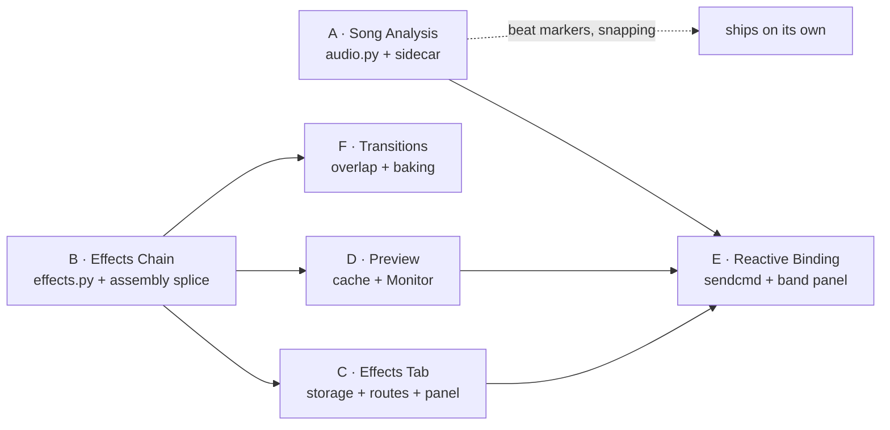

# Build Order — Shot Effects and Transitions

Companion to `ARCHITECTURE-SPINE.md`. How the work splits into buildable slices, what blocks what, and where the risk sits. Not a schedule — a dependency map, so parallel work does not collide.

> **Where things stand, 2026-08-27.** Slices **A, B, C and D are built** — Epic 8 (`epic-8: done`) and Epic 9 (`epic-9: done`, stories 9.1–9.7). **Slice E is next**, and slice F after it. The `Files` rows below were written before the code existed and say `app.py` wherever they mean a route; **the routes moved on 2026-08-26** (`4a1a4f6`, `e6f6b23`) into `src/music_video_producer/routes/`, eight modules holding 60 of the application's 76 routes. Sixteen are still in `app.py`, fifteen of them pinned by tests that monkeypatch a module-level name in `music_video_producer.app`'s namespace — including the **preview route**, which slice D built. Read `routes/__init__.py`'s docstring before adding a route; the `Files` rows are corrected slice by slice below.

---

## The shape

**Two slices start immediately and in parallel: A and B.** ~~They share no files.~~ **Corrected 2026-08-24 (R-9):** they share `effects.py`. AD-28 mandates the one fingerprint function live there and binds FX-1, which is slice A's requirement, so story 8.1 created the file — minimally, holding fingerprinting only. The spine predicted the collision this line denied. Everything else descends from A and B.

---

## Slice A — Song Analysis

**Independent of every other slice.** Nothing in it imports or is imported by the effects work.

| | |
|---|---|
| Delivers | FX-1, FX-2, FX-3 |
| Files | `audio.py` (new), `models.py` (`SongAnalysis`), ~~`app.py`~~ **`routes/song.py`** (`POST .../song/analyze`, `GET .../song/envelope`) + `store.py` (sidecar read/write), waveform frontend — *as built, corrected 2026-08-27* |
| Binds | AD-20, AD-21, AD-26, AD-28 |
| Risk | **Low.** Pure computation with one ffmpeg decode, no new dependency, and a known-good algorithm to port. |

**Ships value on its own, before any effect exists** — beat markers on the waveform and beat-snapping for cut placement. That is the argument for starting it first even though reactive binding is the reason it is in scope: if the rest of this feature slipped entirely, slice A would still have been worth building.

**Watch:** the analysis rate and band count are recorded fields, not constants (spine *Deferred*), so tuning them later is not a migration. Do not hard-code either.

---

## Slice B — Effects Chain

The spine of everything visual. Build it before anything that renders.

| | |
|---|---|
| Delivers | the mechanism behind FX-8..FX-11 |
| Files | `effects.py` (new), `assembly.py` (`trim_args` splice only) |
| Binds | AD-17, AD-25, AD-27, AD-31 |
| Risk | **Medium.** The stage order is measured and settled, but it is the one thing that is invisible in a still and obvious in motion. |

**Build it headless first.** `effects.py` is pure: a stack in, an ordered stage list out, asserted by string comparison. It can be complete and fully tested before a single control exists in the panel, and it should be — the house discipline is that a chain is a text artifact you compare, not a thing you eyeball.

**Watch:** AD-31 says the builder sorts by family on read. Write that test early — it is the difference between a copied stack behaving and a copied stack quietly rendering differently.

---

## Slice C — Effects Tab

| | |
|---|---|
| Delivers | FX-4, FX-5, FX-6, FX-7 |
| Depends on | B (needs a catalogue to render) |
| Files | `models.py` (`EffectSpec`, `Shot.effects`), ~~`app.py` (effects routes + `_adopt_shot_effects`)~~ **`routes/shots.py`** (`GET`/`PUT .../shots/{id}/effects`) + **`routes/unsorted.py`** (`GET /api/effects/catalogue`) + `app.py` (`_adopt_shot_effects`, which stayed a module-level helper the route modules import), `api.js`, `app.js`, `styles.css` — *as built, corrected 2026-08-27* |
| Binds | AD-16, AD-27 |
| Risk | **Medium — and concentrated in one place.** |

**The `_adopt_shot_effects` guard is the highest-value test in this slice.** The generic project PUT has been this project's guard hole ~~six times~~ ~~thirteen times~~ **fourteen times** by the route's own count. Write the test that asserts a full-project PUT omitting `effects` leaves every stack intact *in the same commit that adds the field* — not after.

*Corrected 2026-08-27, and the slice did what this line told it to.* The count was six when this file was written; it is fourteen in `routes/project.py` today, and **the Effect Stack is the thirteenth of the fourteen** — guarded by `_adopt_shot_effects` in the same commit as the field, exactly as instructed. The fourteenth arrived a story later, on the record of what an export looked like. **Re-counted 2026-08-27 and it is fourteen, not thirteen:** the envelope-pointer guard (`_adopt_song_analysis`, 2026-08-24) had been numbered *seventh*, a number `character_slot` already held since 2026-08-21, so one instance was invisible in the route's own ledger. Dated from `git log -S` on each comment, it falls twelfth; the Effect Stack is the thirteenth and the export-look record the fourteenth. Epic 10's `ParameterBinding` gets the same treatment for free by living on `EffectSpec` (ruling R-26), which is why that ruling is worth reading before writing a new adopt helper.

---

## Slice D — Preview

| | |
|---|---|
| Delivers | FX-20, FX-21 (the Shot half) |
| Depends on | B (renders the real chain) |
| Files | `app.py` (preview route + cache) — **and it stays in `app.py`**: `render_shot_preview` is pinned there by `build_effect_stages`, `trim_args` and `probe_take_args` being monkeypatched in that module's namespace *(noted 2026-08-27)*; `app.js` (Monitor) |
| Binds | AD-23, AD-24, AD-28, AD-29 |
| Risk | **Medium.** The mechanism is measured and cheap; the state handling is where it goes wrong. |

Three things carry the risk, none of them the render itself: superseding an in-flight render rather than queueing it (AD-24), deriving staleness rather than storing it (AD-23), and taking preview geometry from the **export** rather than the take (AD-29). Each is one rule, and each fails silently if missed — a queued render plays late, a stored flag goes stale, a wrong geometry shows an un-letterboxed frame.

**Watch:** AD-29's fallback. A project with no approved takes has no derivable export geometry; the preview must say it fell back rather than quietly choosing a different frame.

---

## Slice E — Reactive Binding

| | |
|---|---|
| Delivers | FX-12, FX-13, FX-14, FX-15, FX-22 |
| Depends on | A (envelope), C (parameter rows to bind), D (a preview to judge against) |
| Files | `effects.py` (sendcmd — to be written; AD-25's 2026-08-27 amendment records that none exists yet), `models.py` (`ParameterBinding` on `EffectSpec`, ruling R-26), ~~`app.py`~~ **`routes/shots.py`** for the binding routes and **`routes/song.py`** for anything read off the envelope — but **`app.py`** for the preview and the drive readout if it composes a chain, because `render_shot_preview` is pinned there; band panel + spectrum + drive canvases |
| Binds | AD-22, AD-26, AD-28 |
| Risk | **High on two shared mechanisms, low everywhere else.** Rewritten 2026-08-27 — see below. |

**Corrected 2026-08-27.** This row read ~~"**Medium.** The most new UI, but the least architectural danger — it changes nothing about the grid or the export's shape."~~ The grid clause is true; the conclusion drawn from it is not. This slice cannot be built without touching two mechanisms shared with every render this application makes, and both were verified in the code before this paragraph was written.

**1. A bound stage needs an ffmpeg instance label, and a label changes the composed filter text — which is the preview cache key.** A `sendcmd` addresses a filter by its label (`eq@grade`), so binding a parameter means labelling the stage that carries it, and that stage's text is no longer the text it was. The composed chain is the **fourth of the eight inputs** to `preview_fingerprint`: `PREVIEW_FINGERPRINT_INPUTS = ("take", "window", "offset", "chain", "bindings", "song", "transition", "geometry")` in `effects.py`. That slot held the *stored stack* until 2026-08-26, when AD-28's amendment moved it to the composed chain precisely so the picture and the name cannot disagree — Epic 9 shipped a 26-pixel black bar down the left edge of Scanlines and every clip already cached went on being served with it, permanently, because the stack had not changed. So labelling renames every affected clip in `previews/` by construction. That is correct behaviour and it must be **intended rather than discovered**: see the 2026-08-27 decision *label only stages that carry a binding*, which keeps an unbound Shot's argv byte-identical and its cached previews valid, and the test it requires — that every `sendcmd` target string appears as an `@label` in the chain **produced by the same call**. A command aimed at a filter that is not there is ignored silently, at rc 0, with no warning.

**2. `sendcmd` needs a working-directory contract and the one shared ffmpeg invoker cannot express one.** AD-22 requires a bare relative filename with the process cwd set to the script's directory, because an absolute Windows path's drive-letter colon parses as a filter option separator. `run_tool` — `app.py`, the single `asyncio.create_subprocess_exec` that **both export and preview** go through — takes `args`, `on_progress` and `on_start`, and passes no `cwd`. Giving it one is a change to the invoker every render in this application already uses, made in the slice that needs it least visibly.

**The grid clause stands.** A binding moves values *inside* a clip and never its length, so FX-NFR-1 is untouched and slice F remains the only slice near `assembly_plan`. **Do both shared mechanisms first, each under its own test, before a single control is drawn.**

**Do the `sendcmd` generation as a pure function with a pinned-text test before wiring any control.** The Windows relative-path requirement (AD-22) is not optional and its failure names the wrong filter, which will cost an hour to a builder who has not read that AD.

**Watch:** not every parameter can be driven. Measured 2026-08-27 on this machine's ffmpeg 7.0, `noise`, `vignette`, `unsharp`, `shufflepixels` and `edgedetect` expose **no** runtime-settable option, so grain, vignette, sharpen, pixel shuffle and edge treatment cannot be bound at all — ruling R-25 ships the drivable subset and makes the refusal name the filter. Read it before scoping story 10.1.

**Watch:** the drive model is the part worth porting faithfully rather than approximating. Punch measures level *above its own running average* precisely because raw level pins high on a limited master — an approximation that skips that will produce something that looks broken rather than musical.

---

## Slice F — Transitions

| | |
|---|---|
| Delivers | FX-16..FX-19, and the transition half of FX-21 |
| Depends on | B |
| Files | `assembly.py` (`assembly_plan` + concat list + transition argv), `models.py`, ~~`app.py`~~ **`routes/shots.py`** for the transition routes — but `assemble_project` itself is pinned in **`app.py`** by `trim_args` and `concat_args` being monkeypatched there, so the export path is edited in `app.py` *(corrected 2026-08-27)*, timeline frontend |
| Binds | AD-18, AD-19, AD-30 |
| Risk | **High, and isolated on purpose.** |

**This is the only slice that touches `assembly_plan` and the cumulative frame grid.** It should merge alone, behind its own verification pass against FX-NFR-1, and not concurrently with any other change to `assembly.py`.

The verification that matters is not "does a dissolve look right" — it is **the assembled duration still matching the song within one frame across a matrix of overlap configurations**: no overlap, one overlap, adjacent overlaps, an overlap at the song's start, an overlap at its end, and a one-sided transition beside a paired one. The existing grid assertions must pass unchanged, and gain those cases.

**Watch:** AD-30's tiebreak. It is easy to skip, because in normal operation the pair never disagrees — which is exactly why the one time it does, nothing will have decided what happens.

---

## Sequencing, if one person is building

1. **A and B**, in either order or interleaved. Both are pure, both are testable headless, neither can break anything that exists.
2. **C**, which makes B visible — and write the adopt guard test with the field.
3. **D**, which makes C judgeable. After this the loop is usable and the feature is worth having even if it stopped here.
4. **E**, the largest UI slice, on a foundation that is already proven.
5. **F**, last and alone, with the grid matrix in front of you.

The natural stopping points are after **D** — a complete, previewable grading tool — and after **E**. Slice F is the only one that must not be rushed to hit either.

---

## Blocked before you start

Two items from the spine's *Deferred* are prerequisites for specific slices rather than general future work:

- ~~**LUT source and licence** blocks the Grade family shipping in slice B/C. It does not block `effects.py`'s structure — build against a placeholder set and swap.~~ **Resolved 2026-08-27 by not arising:** the Grade family shipped in Epic 9 against a **generated** pack. `effects.py`'s `write_default_luts` writes each `.cube` from `DEFAULT_LUTS`' own transforms through `cube_text`, into an empty folder, never overwriting a Director's file, each one whole or not at all. Nothing was licensed and nothing is blocked. The question returns only if a third-party pack is ever bundled.
- **Full-resolution export cost** of a reactive binding and of transition segments is unmeasured. CM-E1 makes an export regression a defect rather than a cost, so measure it before E and F merge, not after.
