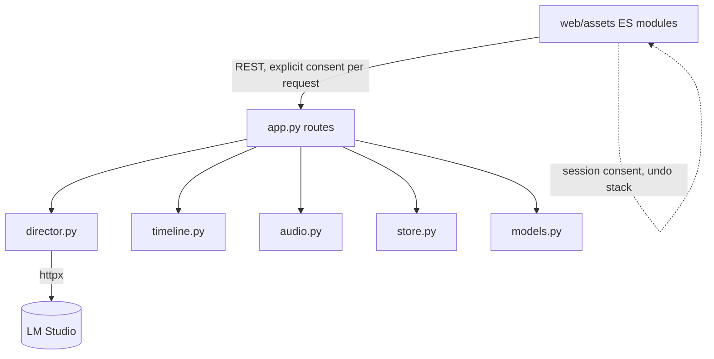

# Architecture Spine — Treatment Planning

## Design Paradigm

Inherited unchanged. This feature adds **no module, no process, no transport and no storage engine** — it adds fields, tools, routes and one frontend rendering technique.

The statement that governs every AD below:

> **Consent, staleness and provenance are all *derived or explicit*, never ambient.** Nothing in this feature stores a flag that can outlive the condition it describes, and nothing in it lets the server act on an authority the request did not carry.



The dotted edge is the point of AD-34 and AD-35: Planning Mode's session state is **frontend-only** and never crosses the wire as a standing authority.

## Inherited Invariants

Binding, read-only. Not re-derived.

| AD | Why it constrains this feature |
| --- | --- |
| **AD-11** — missing media computed at read time, never persisted | The precedent for AD-37: staleness is a read-time verdict, never a stored flag |
| **AD-14** — model output crosses the persistence boundary only through guards | Every planning tool's output is guarded; AD-38 and AD-39 are its application here |
| **AD-15** — standing boundary policies | ComfyUI untouched; local model only |
| **AD-16** (effects) — new `Shot` fields written only by dedicated routes, adopted in `replace_project` | The idiom AD-41 and AD-36 follow verbatim |
| **AD-21** (effects) — validity derived by comparison, never a stored flag | Same discipline as AD-37 |
| **AD-25** (effects) — `audio.py` exists as a leaf module: it imports the standard library and numpy, nothing from this package, and reaches outside itself only to decode audio through ffmpeg. *("and is pure" corrected 2026-08-26 — `audio.py` shells out to `subprocess.run`, which AD-25's own Rule has always said; the leaf-module property is what this row was relying on.)* | AD-40 composes it without importing it into `director.py` |
| Consistency Conventions (schema evolution, state mutation, IDs, tests) | Apply verbatim. New fields defaulted; every mutation through `store.save` |

No AD below contradicts or weakens an inherited one.

## Invariants & Rules

### AD-32 — Attribution renders as a mirror overlay, never a contenteditable

- **Binds:** TP-8
- **Prevents:** a hand-rolled rich editor reimplementing selection, paste, undo, IME and spellcheck, in a codebase with no libraries to lean on
- **Rule:** The Brief stays a real `<textarea>`. Attribution is drawn by a **read-only styled div positioned behind it**, sharing its font, size, line-height, padding and wrapping exactly, with the textarea's own background transparent. Ranges are highlighted in the mirror; text, caret and selection remain the browser's. The mirror scrolls with the textarea and is `aria-hidden` — the attribution's accessible expression is the range list, not the paint. **No `contenteditable` is introduced anywhere in this application.**

### AD-33 — Attribution ranges are offsets on the Project, reconciled by diff on every write

- **Binds:** TP-8
- **Prevents:** ranges drifting silently as the Brief is edited, and marks that survive text the Director has replaced
- **Rule:** `Project.brief_attribution: list[BriefRange]`, defaulted, each carrying `start`, `end` and the `message_id` that wrote it. **Every Brief write runs one pure reconciliation** over (stored text, stored ranges, new text): a range whose exact text still appears, shifted, survives with adjusted offsets; a range whose text changed is **dropped**. That function is where *"editing a range clears its mark"* becomes true rather than aspirational, and it is asserted by comparison in tests like every other pure function here. Ranges are written only by the planning routes and by the reconciliation; `replace_project` adopts them from the stored Project (AD-41's idiom).

### AD-34 — Session undo is frontend-only and bounded

- **Binds:** TP-9, TP-NFR-1
- **Prevents:** a persisted revision history nobody asked for, and an unbounded in-memory stack on a long conversation
- **Rule:** The planning session's undo stack lives in **frontend state**, holding prior Brief text and its attribution ranges, bounded at a fixed depth. Nothing is persisted; a reload loses the stack, which the UX states plainly. **The persisted recovery slot (AD-41) is the durable floor** and holds the version the session began from. This follows the standing paradigm — derived and session state beats stored state — and AD-11's precedent.

### AD-35 — Session consent is a client affordance; the wire is explicit every time

- **Binds:** TP-6, TP-NFR-1, TP-NFR-5
- **Prevents:** the server holding an ambient authority to write documents — the exact shape of every guard hole this project has found
- **Rule:** Planning Mode is **frontend state**. Every planning request carries its document-write consent **explicitly, per request**, exactly as the existing per-turn consent does on the wire. The server never stores, infers, or remembers consent, and a request without it is refused. What "session consent" buys is that the Director ticks nothing per turn; what it must not buy is a server that will write a document because of something it was told earlier.

### AD-36 — Suggested Assets live on the Project, narrow-gated

- **Binds:** TP-11, TP-12, TP-13
- **Prevents:** a whole-manifest save clearing a proposal list, and proposals costing GPU time by existing
- **Rule:** `Project.asset_proposals: list[AssetProposal]`, defaulted. Each proposal carries an id, its kind/name/prompt, and its **origin text** — the Brief passage that called for it. Written **only** by dedicated proposal routes; `replace_project` adopts them from the stored Project via the established `_adopt_*` idiom. **A proposal is inert**: storing one queues nothing, and acceptance is a separate, confirmed act that produces an ordinary Asset.

### AD-37 — Staleness is derived from the origin, never stored

- **Binds:** TP-13
- **Prevents:** a stale flag that outlives the condition, and a proposal deleted because the application guessed
- **Rule:** A proposal is stale when **its recorded origin text no longer appears in the current Brief**, decided at read time by comparison. Nothing writes a stale flag. A proposal with **no** recorded origin is never stale — an unknown origin is not evidence. Staleness never removes, blocks, or refuses anything; it is reported and the Director decides (R-14).

### AD-38 — Asking and writing are separate tools, not one tool with optional fields

- **Binds:** TP-7, TP-NFR-5
- **Prevents:** a question-only turn being indistinguishable from a turn whose document field the model dropped
- **Rule:** The assistant gains **separate tools** — one that asks and writes nothing, one that writes the Brief, one that proposes assets. Each has its own strict schema with **every field promoted through the existing `_promoted()`**, which raises on an unknown name. This is not stylistic. On a model documented to drop boolean and object fields silently, *an optional field and a dropped field are the same bytes* — so the shape that makes "asked a question, wrote nothing" representable is a different tool, not a missing key. `DirectorResult` never requiring `shots` was the root cause of every empty-shots failure; this AD is that lesson applied before the fact.

### AD-39 — A long pass validates before it writes, and reports what it could not do

- **Binds:** TP-3, TP-4, TP-NFR-5
- **Prevents:** a half-parsed reply landing in the Brief, and a timeout surfacing as a blank
- **Rule:** Suggest Video runs with a **configurable timeout** (the `DirectorClient` timeout is already a parameter) and **retries once** on timeout or malformed output, because reasoning length varies 26× across identical rolls and a second roll is genuinely a different roll. **Nothing is written until the reply validates**; a failed pass leaves the Brief byte-identical. A reply that validates but is thin against its required fields is stored and **reported as partial**. A failure is reported by exception class and elapsed time — never by its string, because a `ReadTimeout` stringifies to `""`.

### AD-40 — One analysis job composes two analyses without merging them

- **Binds:** TP-18, and effects FX-1 by R-17
- **Prevents:** the Director sitting through two passes for a distinction they never asked about, and two analyses fused into one function that can no longer be tested apart
- **Rule:** The Song → Treatment offer triggers **one job with one progress state** that runs both the existing `align-lyrics` structure pass and `audio.py`'s Song Envelope. **The two computations stay separate functions in separate modules**, each independently callable and independently tested; only the *trigger and the reporting* are shared. Either half failing is reported by name and does not fail the other. Treatment Planning owns this because effects Story 8.1 ships first (R-17).

### AD-41 — The Brief joins the document apparatus, unchanged

- **Binds:** TP-1, TP-2
- **Prevents:** a third document with a fourth set of rules
- **Rule:** `creative_brief_previous` and `creative_brief_locked` are added, defaulted, and the Brief gains a `DOCUMENT_CONTROLS` entry so lock, recovery and restore behave **identically** to `treatment` and `style_bible`. `replace_project` adopts all three of `creative_brief`, `brief_attribution` and `asset_proposals` from the stored Project via the established `_adopt_*` idiom. A test asserts a full-project PUT omitting each of them leaves it intact.

### AD-42 — The Song Planner writes no server state

- **Binds:** TP-20, TP-21
- **Prevents:** a "fill the form" pass that quietly becomes a "change the song" pass
- **Rule:** The Song Planner route **returns fields and stores nothing** — no Song write, no Project write, no job. The frontend places them in the form where the Director edits them. Generation remains a separate, existing act. This is the whole of R-9 expressed as a boundary rather than as a promise.

### AD-43 — Planning turns are ordinary messages carrying structured notices

- **Binds:** TP-7, TP-8
- **Prevents:** a parallel conversation record, and change announcements parsed back out of prose
- **Rule:** A planning turn is a `TreatmentMessage` like any other. What it changed is carried as **`MessageNotice` entries** — the existing structured "what this reply reports about itself" mechanism — not as a convention inside `content`. The `message_id` a notice belongs to is what `brief_attribution` points at (AD-33), so *"which turn wrote this paragraph"* resolves without a second index.

### AD-44 — Undo restores a snapshot verbatim and never reconciles

- **Binds:** TP-9, AD-33, AD-34
- **Prevents:** stepping back stripping the very attribution marks it is restoring
- **Rule:** A session-undo snapshot holds Brief text **and** its attribution ranges, already consistent with each other. Restoring one writes both **verbatim, bypassing AD-33's reconciliation entirely**. Reconciliation exists to answer *"the Director edited this, what survives"*; an undo is not an edit, it is a return to a state that was already coherent. A builder that routes undo through the ordinary write path will silently drop every mark it meant to bring back.

### AD-45 — The client never sends attribution ranges; the server always derives them

- **Binds:** TP-8, AD-33
- **Prevents:** two sources of truth for a range, disagreeing after an ordinary keystroke
- **Rule:** Ordinary Brief saves carry **text only**. The server reconciles the stored ranges against the incoming text (AD-33) and is the sole writer of `brief_attribution`. The **one exception is AD-44's undo**, which is an explicit restore of a named snapshot and says so on the wire rather than presenting itself as a save. A client that computed ranges and sent them would be a second authority on provenance, and provenance with two authorities is provenance with none.

### AD-46 — An accepted proposal is marked, not removed

- **Binds:** TP-12, AD-36
- **Prevents:** the same proposal being accepted twice, and the list losing the record of what it produced
- **Rule:** Accepting a proposal records the **Asset id it produced** on the proposal and marks it accepted; it does not delete it. An accepted proposal is not re-offered, does not re-generate, and is not flagged stale (AD-37 applies to unaccepted proposals only). Deleting a proposal is the Director's separate act and never touches the Asset it made. Without this, one builder clears the list on acceptance and another leaves it, and a second press of *Accept* either duplicates an Asset or does nothing, depending on which builder wrote which half.

### AD-47 — Each half of the combined analysis is skipped when it is already current

- **Binds:** TP-18, AD-40, and effects FX-1
- **Prevents:** the Director waiting through work that was already done, on a trigger built to save them exactly that
- **Rule:** The combined job (AD-40) checks each half's **own** freshness before running it — the Song Envelope by its song fingerprint (effects AD-21), the structure pass by whether sections exist for the current Song — and runs only what is stale or absent. Effects `FX-1` produces an envelope **automatically on song import**, so the common case at this trigger is that one half is already current. The job reports what it ran and what it skipped, so a fast completion reads as *"already done"* rather than as a failure to do anything.

## Consistency Conventions

Inherited tables apply. Deltas:

| Concern | Convention |
| --- | --- |
| Consent | Carried explicitly on every request that writes a document. Never stored, never inferred, never remembered |
| Session state | Planning Mode and the undo stack are frontend-only and are lost on reload, by design |
| Derived vs stored | Extended: staleness, attribution validity after an edit, and analysis freshness are all computed |
| New manifest fields | Defaulted, and adopted server-side in `replace_project` wherever a whole-manifest PUT could clear them |
| Model tool schemas | Every required field promoted through `_promoted()`; a capability the model may decline is a **separate tool**, never an optional field |
| Failure reporting | By exception class and elapsed time, never by `str(exc)` — a `ReadTimeout` stringifies to `""` |
| Accessibility | A visual-only affordance always has a non-visual expression; the attribution mirror is `aria-hidden` and the range list is the accessible form |

## Stack

Seed. No additions.

| Name | Version | Note |
| --- | --- | --- |
| Everything | unchanged | No package added. `audio.py` arrives with effects Story 8.1, which ships first |

## Structural Seed

```text
src/music_video_producer/
  models.py     # + BriefRange, Project.brief_attribution, Project.asset_proposals
                # + creative_brief_previous / creative_brief_locked
                # + AssetProposal gains id and origin text
  director.py   # + planning tools (ask / write_brief / propose_assets), each with its own
                #   strict schema promoted through _promoted(); + suggest_video()
  app.py        # + planning, proposal, suggest-video, song-planner and combined-analysis
                #   routes; + _adopt_brief_fields; + brief attribution reconciliation
  audio.py      # (from effects 8.1) composed by the analysis job, never imported by director
  web/assets/   # + planning bar, attribution mirror overlay, session undo stack,
                #   Assets tab, proceed offers, Song Planner form fill
```

## Capability → Architecture Map

| Capability | Where it lands |
| --- | --- |
| TP-1, TP-2 Brief protections and contract | AD-41 |
| TP-3 – TP-5 Suggest Video | AD-39, AD-38 |
| TP-6 Planning Mode | AD-35 |
| TP-7 assistant asks as well as executes | AD-38, AD-43 |
| TP-8 visible, attributable edits | AD-32, AD-33, AD-43 |
| TP-9 session undo | AD-34 |
| TP-10 planning writes no other document | AD-38 (no tool exists for it) |
| TP-11 – TP-13 Suggested Assets | AD-36, AD-37 |
| TP-14 – TP-16 character planning | AD-36; multiview path inherited and already widened |
| TP-17 – TP-19 proceed offers | AD-40 |
| TP-20, TP-21 Song Planner | AD-42 |
| TP-NFR-1 nothing lost | AD-33, AD-34, AD-41 |
| TP-NFR-2 nothing spends GPU unconfirmed | AD-36 |
| TP-NFR-3 local-first | inherited AD-15 |
| TP-NFR-4 usable during a long pass | AD-39 |
| TP-NFR-5 guarded persistence boundary | AD-38, AD-39, inherited AD-14 |

## Deferred

- **The undo stack's depth.** AD-34 fixes that it is bounded and frontend-only; the number is a tuning value, set once a real planning session exists. `[ASSUMPTION: a depth in the low tens is ample for one conversation; a session that exceeds it has other problems.]`
- **The Suggest Video timeout value.** AD-39 fixes the shape; R-11 authorises raising the director timeout and sets the value from live measurement during the build.
- **Whether a planning turn shows the long-pass indicator.** A 20–40 s turn may want something lighter. UX open question; no architectural dependency.
- **Whether attribution survives a Treatment/Style Bible regeneration.** Those generate *from* the Brief and do not write it, so ranges should be untouched — worth asserting rather than assuming.
- **Bounding the thread each planning turn sends.** R-12 keeps LM Studio at 75k and names the accumulating thread as the pass that will creep. Windowing or summarising is undecided and is not needed to ship.
- **Re-measuring `populate`.** Carried from R-11: richer Briefs make richer Treatments, which are populate's input.
