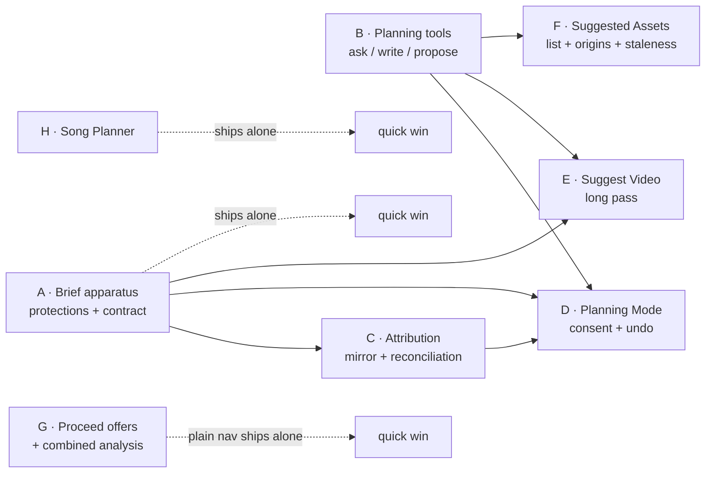

# Build Order — Treatment Planning

Companion to `ARCHITECTURE-SPINE.md`. How the work splits, what blocks what, and where the risk sits. A dependency map, not a schedule.

---

## The shape

**Three slices ship on their own and block nothing: A, H, and the plain half of G.** Everything else descends from A and B.

---

## Slice A — The Brief apparatus  *(shipped 2026-09-03)*

| | |
|---|---|
| Delivers | TP-1, TP-2 |
| Depends on | nothing |
| Binds | AD-41 |
| Risk | ~~**Low.** A third instance of a pattern that exists twice.~~ **Measured: not low.** The pattern existed twice because two documents shared one mapping that was answering *two* questions — has the apparatus, and may an ordinary reply rewrite it. The Brief has the first and not the second, so it is not a third instance of anything: the mapping had to split (`DOCUMENT_LABELS` / `DIRECTOR_REPLACEABLE_DOCUMENTS`), every derived site had to be pointed at the one that answers its question, and the capture moved to a different route on a Director ruling. |

`creative_brief_previous`, `creative_brief_locked`, a `DOCUMENT_CONTROLS` entry, the contract line, and the `replace_project` adoption.

*Built 2026-09-03, with two departures worth recording.* There is no `_adopt_brief_fields`: the adopt loop is driven off `DOCUMENT_LABELS`, so the Brief is adopted by being in that mapping and a helper would have been a second list to keep level. And the risk line below was wrong — see it.

**Write the adopt test in the same commit as the fields.** ~~That route's own comments count six findings of this hole~~ *(stale when written: the count was fourteen by 2026-08-27 and the Brief is the **sixteenth**, 2026-09-03)*; this is another case where it has been closed *before* a field existed rather than after it cleared someone's work.

**Ships value alone:** the Brief gets the whole apparatus whether or not anything else in this feature is ever built, and it ends up the best protected of the three documents. *Amended 2026-09-03:* this said ~~FR-16 stops having an exception~~ without qualification, and that is not what shipped. FR-16 now holds against every **machine** write for all three; against the Director's **own save** the Brief holds and `treatment` and `style_bible` do not, which is a residue in the opposite direction and is recorded in `docs/BUILD-HANDOFF.md` §6.

---

## Slice B — The planning tools  *(shipped 2026-09-03)*

| | |
|---|---|
| Delivers | the mechanism behind TP-7, TP-10 |
| Depends on | nothing |
| Binds | AD-38, AD-43 |
| Risk | **Medium**, and concentrated in the schemas — which is where it turned out to be. |

Three separate tools — `ask_director`, `write_brief`, `propose_assets` — each with its own strict schema, **every required field promoted through `_promoted()`**, plus `POST /api/projects/{id}/planning/turn` carrying AD-35's per-request consent.

**The required lists are the load-bearing part, not the prompts.** `_promoted()` raises on an unknown name precisely because `shots` was asked for in words across three measured runs while the grammar never mentioned it. Get the lists right and a dropped field becomes a validation failure; get them wrong and it becomes a silent no-op that narrates success.

*Amended 2026-09-03 by the slice that built it, because the sentence above prescribes a mechanism that does not work on its own.* `_promoted()` **folds** a caller's names into the `required` list Pydantic already produced, which is correct where it was written — `constrained_schema` tightens a grammar the model owns — and inert here: a field with no default is required for free, so on these three argument models every promoted name was a name the schema already had. Deleting one changed nothing and no test could fail. `_strict_tool_schema` clears the inherited list before promoting, so the tuple is the sole statement of what the wire requires, and it then refuses to emit any tool with an optional field left over. **The verification step this file and the slice spec both prescribe — "delete a name from the `_promoted()` list and watch a test fail" — survives without that one line.** It was run: mutation M1 survives against the folding form and is killed against the shipped one.

**Build headless.** Tools and schemas are testable with a recording double before any UI exists, and should be. Built that way: no GPU, no LM Studio, no render, no pixel, and neither JS asset moved.

**What it did not do:** the Brief's recovery slot now has two writers. `SAVE_CAPTURED_DOCUMENTS` is derived from `DIRECTOR_REPLACEABLE_DOCUMENTS` on Slice A's argument that *no reply can write the Brief*, so `DOCUMENT_SLOT_DISPLACEMENT["creative_brief"]` reads "save that changed it" — and a restore after a planning write now tells the Director their kept version came from a save. `write_brief` captures the slot (not capturing would leave a machine write with no recovery until AD-44's undo lands in Slice D), and the wording was left alone because correcting it moves `api.js`, which mirrors the same two phrases, and because which writer the sentence should name is a Director call. **Slice D owns it.**

---

## Slice C — Attribution

| | |
|---|---|
| Delivers | TP-8 |
| Depends on | A |
| Binds | AD-32, AD-33, AD-45 |
| Risk | **Medium.** The reconciliation is pure and easy; the mirror is fiddly. |

Two independent halves, and they should be built in this order:

1. **The reconciliation function** (AD-33) — pure, `(old text, ranges, new text) → ranges`, asserted by comparison. Complete and fully tested before any pixel moves.
2. **The mirror overlay** (AD-32) — a styled read-only div behind a transparent textarea. The fiddly part is metric parity: font, size, line-height, padding, wrapping and scroll must match exactly or the highlight drifts from the text. Verify by scrolling and by resizing, not by looking at the top of the box.

**Watch:** AD-45. The client sends text only; the server is the sole writer of ranges. A frontend that computes ranges "to save a round trip" creates a second authority on provenance.

---

## Slice D — Planning Mode

| | |
|---|---|
| Delivers | TP-6, TP-9 |
| Depends on | A, B, C |
| Binds | AD-34, AD-35, AD-44 |
| Risk | **Medium — and this is the slice where a safety property can be lost quietly.** |

**AD-35 is the one to get right.** Session consent is a *client* affordance; every request still carries consent explicitly. It is easy to "simplify" this into a server-side session flag, and that flag is the exact shape of every guard hole this project has found. A test should assert that a planning write request **without** explicit consent is refused, regardless of anything sent earlier.

**AD-44 is the one most likely to be missed:** undo restores a snapshot verbatim and bypasses reconciliation. Route undo through the ordinary write path and it will strip the marks it was meant to bring back — and it will look like it worked.

---

## Slice E — Suggest Video

| | |
|---|---|
| Delivers | TP-3, TP-4, TP-5 |
| Depends on | A, B |
| Binds | AD-39 |
| Risk | **Medium**, entirely in the failure paths. |

The happy path is one call. The requirement is the unhappy paths: bounded timeout, one retry, **nothing written until the reply validates**, partial reported as partial, and a failure reported by exception class and elapsed time.

**Watch:** a `ReadTimeout` stringifies to `""`. A failure reported by its string surfaces as a blank, which reads as a bug in the application rather than a timeout in the model.

**Owed measurement:** the timeout value (R-11). Set it from live runs; raising the director timeout is authorised.

---

## Slice F — Suggested Assets

| | |
|---|---|
| Delivers | TP-11 – TP-16 |
| Depends on | B |
| Binds | AD-36, AD-37, AD-46 |
| Risk | **Low–medium.** `stage_manager` already produces proposals; this adds a place for them to wait. |

**Watch:** AD-46. An accepted proposal is *marked with the Asset id it produced*, not deleted. Leave that undecided and a second press of Accept either duplicates an Asset or silently does nothing, depending on which half was written first.

Character planning (TP-14 – TP-16) rides here: the multiview path is already widened to `character`/`prop`/`setting`, so submitting an image and converting it uses machinery that exists.

---

## Slice G — Proceed offers and the combined analysis

| | |
|---|---|
| Delivers | TP-17, TP-18, TP-19 |
| Depends on | plain navigation: nothing · the Song offer: effects Story 8.1 · the Assets offer: F |
| Binds | AD-40, AD-47 |
| Risk | **Low for the navigation, medium for the combined job.** |

**Split this slice.** The plain proceed controls — three buttons naming their next phase — depend on nothing and can ship immediately as a quick win. The offers attach later.

**The combined analysis (AD-40, AD-47) is the cross-feature obligation.** It composes `align-lyrics` and `audio.py` behind one job and one progress state **without merging them**, and skips either half that is already current. Effects `FX-1` analyses automatically on song import, so the common case is that the envelope half is already done and the job finishes fast — which must read as *"already done"*, not as a failure to run.

**This slice cannot start before effects Story 8.1 ships**, which is the sequencing the Director accepted.

---

## Slice H — The Song Planner

| | |
|---|---|
| Delivers | TP-20, TP-21 |
| Depends on | nothing |
| Binds | AD-42 |
| Risk | **Low.** One route that stores nothing. |

**Fully independent of every other slice**, and it sits at the true start of the workflow. `api.js` already reuses the `caption` field as the "idea" for both SongPlanner presets, so half the plumbing is there.

**Watch:** AD-42 is a boundary, not a promise. The route returns fields and writes no server state — no Song, no Project, no job. A route that "helpfully" saved the title would turn a fill-the-form pass into a change-the-song pass.

---

## Sequencing, if one person is building

1. **A**, **B** and **H** in any order — none blocks the others, all are testable headless, and A and H each ship value alone.
2. **C**, reconciliation first and the mirror second.
3. **D**, on a foundation that is already proven. Assert the no-ambient-consent rule here.
4. **E**, whose value is mostly in its failure paths.
5. **F**, which makes the Brief's output actionable.
6. **G**, last — its offers depend on F, and its combined analysis depends on effects Story 8.1.

Natural stopping points: after **D**, where planning is real and usable without Suggest Video; and after **E**, which is the feature as the Director described it.

---

## Cross-feature note

**Effects Story 8.1 ships first** (the Director's decision, R-17). That makes two things true here: `audio.py` exists before slice G needs it, and **Treatment Planning owns the shared analysis trigger** — the obligation to present one moment and one indicator rather than two passes. AD-40 and AD-47 are that obligation; nothing in the effects work has to change.
